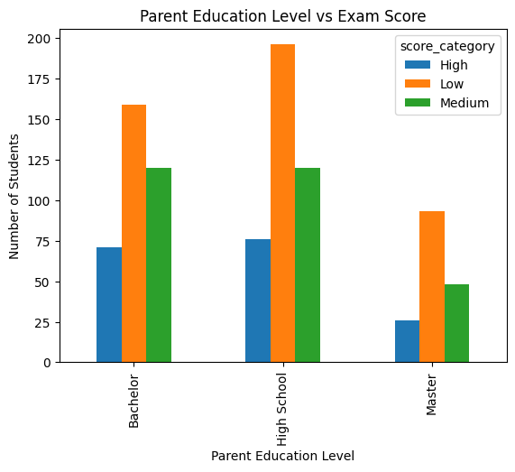
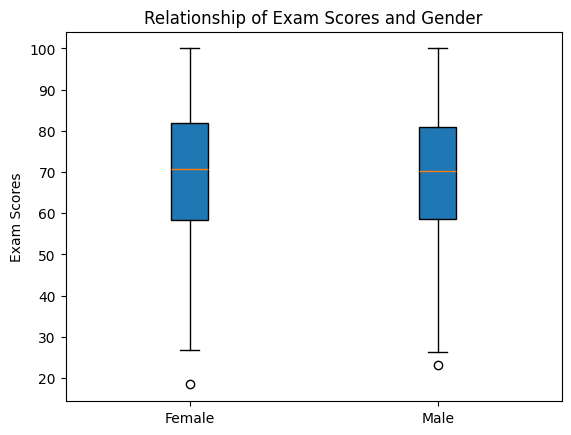
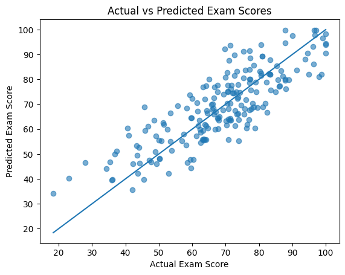
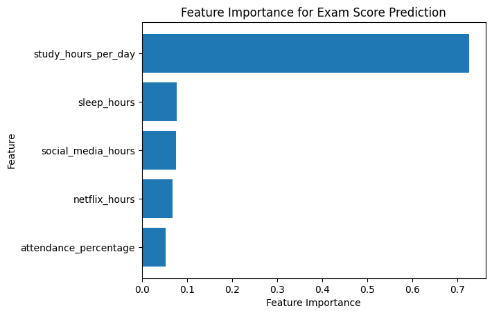
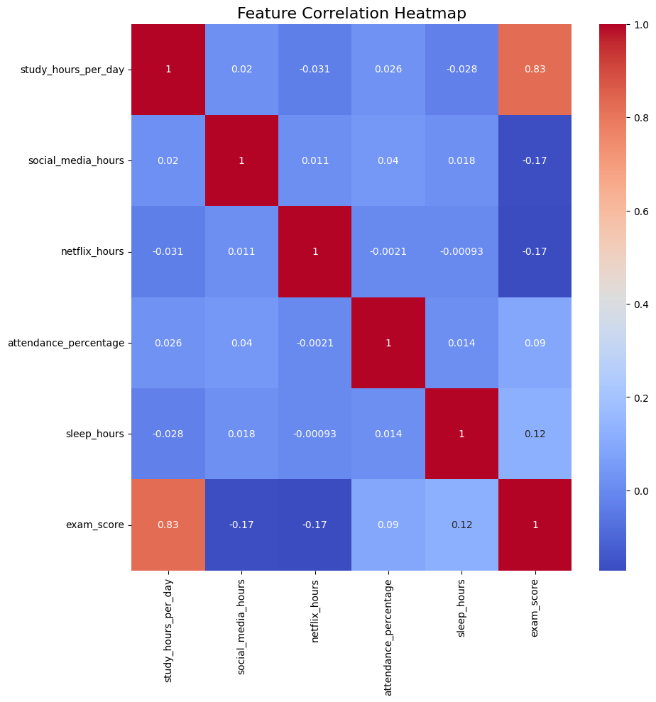
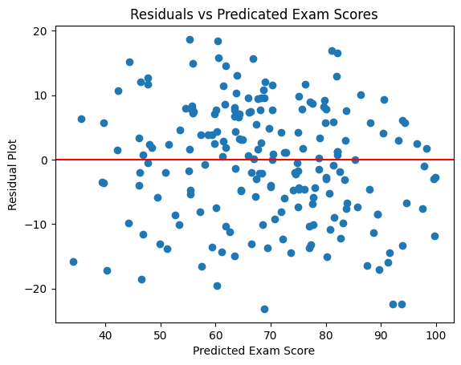
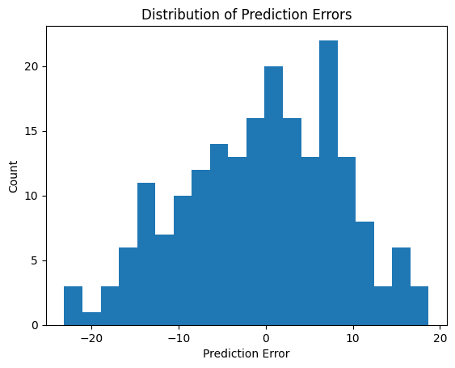

# **Exploring Factors that Influence Student Exam Scores**
### Fall 2025 Data Science Project
### By: Leah Brennan, Priyanshi Patel, Reuben Puthumana, Maya Cleveland

# **Contributions**

**Priyanshi Patel** - I chose the project idea and worked on the introduction, basic data exploration, and statistical analysis. Additionally, I determined which model would be best for the data, worked on the model's primary analysis, model evaluation, and visualization.  

**Leah Brennan** - I did the dataset curation and preprocessing, such as transforming the data, parsing, and organizing, and I also did two of the visualizations for the ML model. I helped write parts of the data exploration and summary statistics, as well as the overall analysis and explanations throughout each section.

**Reuben Puthumana** - I assisted with the intial Chi-square statistical testing and was responsible for compiling the technical results into final conclusions. This involved interpreting our data to identify actionable insights and defining the future steps of our work.

**Maya Cleveland**- I conducted the correlation analysis and other statistical hypothesis tests to evaluate relationships between variables and exam scores. I created visualizations to support our Random Forest model’s results and explained their relevance. I also cited external resources for readers interested in learning more and turned our project into a GitHub Pages website for presentation.

# **Introduction**

Understanding the factors that influence student academic performance is a widely researched topic in social sciences as it has important applications for parents, teachers, students, and policymakers. In a time where there is a large stress on academic success, it is valuable to identify which study habits and demographic factors correlate to higher exam scores, and which factors are unimportant. This project investigates how variables such as parental education level, number of study hours per day, and gender relate to exam performance.

Our analysis is driven by three investigative points. The first relationship we explore is between a students exam score and their parental education level. The second relationship is between the number of hours a student studies and thier exam score. The last is between the gender and the number of study hours. Exploring these relationships is important to help shape educational policies, resource allocations for schools, and expectations placed on students.

Through hypothesis tests and statistical analysis of our study habits dataset, we hope to identify relationships between environmental factors, study habits, and academic performance.

# Data Curation

**Dataset Chosen:** Student Habits vs. Academic Performance (Kaggle)

**Dataset Citation:**  
Jayanta Nath. (n.d.). *Student Habits vs Academic Performance*. Kaggle.  
[https://www.kaggle.com/datasets/jayaantanaath/student-habits-vs-academic-performance](https://www.kaggle.com/datasets/jayaantanaath/student-habits-vs-academic-performance)

## Dataset Description

The dataset comes from Kaggle and contains information about approximately 1,000 students and their daily habits, lifestyle factors, and academic performance. Each row represents one student, with 16 columns covering demographic details (age, gender), behavioral variables (study hours per day, social media use, Netflix hours, sleep hours, exercise frequency), and school-related factors (attendance percentage, part-time job status, mental health rating, extracurricular participation). The dataset also includes ratings such as diet quality and internet quality, along with parental education level. The primary outcome variable is `exam_score`, which measures each student’s academic performance. Overall, the dataset provides a broad view of habits and conditions that may relate to student success.

## Imports


```python
import pandas as pd
```

# Transform the Data
First, we load the dataset containing student habits and exam performance using the read_csv function from pandas. The dataset is displayed to show us the data structure, view the columns, and verify that the data loaded correctly before we proceed with preprocessing.


You can get more information about the Pandas Library at: [https://pandas.pydata.org/docs/reference/frame.html](https://pandas.pydata.org/docs/reference/frame.html)


```python
df = pd.read_csv('student_habits_performance.csv')
display(df)
```


  <div id="df-17e21486-0997-4007-bcab-28a20577c3fb" class="colab-df-container">
    <div>
<style scoped>
    .dataframe tbody tr th:only-of-type {
        vertical-align: middle;
    }

    .dataframe tbody tr th {
        vertical-align: top;
    }

    .dataframe thead th {
        text-align: right;
    }
</style>
<table border="1" class="dataframe">
  <thead>
    <tr style="text-align: right;">
      <th></th>
      <th>student_id</th>
      <th>age</th>
      <th>gender</th>
      <th>study_hours_per_day</th>
      <th>social_media_hours</th>
      <th>netflix_hours</th>
      <th>part_time_job</th>
      <th>attendance_percentage</th>
      <th>sleep_hours</th>
      <th>diet_quality</th>
      <th>exercise_frequency</th>
      <th>parental_education_level</th>
      <th>internet_quality</th>
      <th>mental_health_rating</th>
      <th>extracurricular_participation</th>
      <th>exam_score</th>
    </tr>
  </thead>
  <tbody>
    <tr>
      <th>0</th>
      <td>S1000</td>
      <td>23</td>
      <td>Female</td>
      <td>0.0</td>
      <td>1.2</td>
      <td>1.1</td>
      <td>No</td>
      <td>85.0</td>
      <td>8.0</td>
      <td>Fair</td>
      <td>6</td>
      <td>Master</td>
      <td>Average</td>
      <td>8</td>
      <td>Yes</td>
      <td>56.2</td>
    </tr>
    <tr>
      <th>1</th>
      <td>S1001</td>
      <td>20</td>
      <td>Female</td>
      <td>6.9</td>
      <td>2.8</td>
      <td>2.3</td>
      <td>No</td>
      <td>97.3</td>
      <td>4.6</td>
      <td>Good</td>
      <td>6</td>
      <td>High School</td>
      <td>Average</td>
      <td>8</td>
      <td>No</td>
      <td>100.0</td>
    </tr>
    <tr>
      <th>2</th>
      <td>S1002</td>
      <td>21</td>
      <td>Male</td>
      <td>1.4</td>
      <td>3.1</td>
      <td>1.3</td>
      <td>No</td>
      <td>94.8</td>
      <td>8.0</td>
      <td>Poor</td>
      <td>1</td>
      <td>High School</td>
      <td>Poor</td>
      <td>1</td>
      <td>No</td>
      <td>34.3</td>
    </tr>
    <tr>
      <th>3</th>
      <td>S1003</td>
      <td>23</td>
      <td>Female</td>
      <td>1.0</td>
      <td>3.9</td>
      <td>1.0</td>
      <td>No</td>
      <td>71.0</td>
      <td>9.2</td>
      <td>Poor</td>
      <td>4</td>
      <td>Master</td>
      <td>Good</td>
      <td>1</td>
      <td>Yes</td>
      <td>26.8</td>
    </tr>
    <tr>
      <th>4</th>
      <td>S1004</td>
      <td>19</td>
      <td>Female</td>
      <td>5.0</td>
      <td>4.4</td>
      <td>0.5</td>
      <td>No</td>
      <td>90.9</td>
      <td>4.9</td>
      <td>Fair</td>
      <td>3</td>
      <td>Master</td>
      <td>Good</td>
      <td>1</td>
      <td>No</td>
      <td>66.4</td>
    </tr>
    <tr>
      <th>...</th>
      <td>...</td>
      <td>...</td>
      <td>...</td>
      <td>...</td>
      <td>...</td>
      <td>...</td>
      <td>...</td>
      <td>...</td>
      <td>...</td>
      <td>...</td>
      <td>...</td>
      <td>...</td>
      <td>...</td>
      <td>...</td>
      <td>...</td>
      <td>...</td>
    </tr>
    <tr>
      <th>995</th>
      <td>S1995</td>
      <td>21</td>
      <td>Female</td>
      <td>2.6</td>
      <td>0.5</td>
      <td>1.6</td>
      <td>No</td>
      <td>77.0</td>
      <td>7.5</td>
      <td>Fair</td>
      <td>2</td>
      <td>High School</td>
      <td>Good</td>
      <td>6</td>
      <td>Yes</td>
      <td>76.1</td>
    </tr>
    <tr>
      <th>996</th>
      <td>S1996</td>
      <td>17</td>
      <td>Female</td>
      <td>2.9</td>
      <td>1.0</td>
      <td>2.4</td>
      <td>Yes</td>
      <td>86.0</td>
      <td>6.8</td>
      <td>Poor</td>
      <td>1</td>
      <td>High School</td>
      <td>Average</td>
      <td>6</td>
      <td>Yes</td>
      <td>65.9</td>
    </tr>
    <tr>
      <th>997</th>
      <td>S1997</td>
      <td>20</td>
      <td>Male</td>
      <td>3.0</td>
      <td>2.6</td>
      <td>1.3</td>
      <td>No</td>
      <td>61.9</td>
      <td>6.5</td>
      <td>Good</td>
      <td>5</td>
      <td>Bachelor</td>
      <td>Good</td>
      <td>9</td>
      <td>Yes</td>
      <td>64.4</td>
    </tr>
    <tr>
      <th>998</th>
      <td>S1998</td>
      <td>24</td>
      <td>Male</td>
      <td>5.4</td>
      <td>4.1</td>
      <td>1.1</td>
      <td>Yes</td>
      <td>100.0</td>
      <td>7.6</td>
      <td>Fair</td>
      <td>0</td>
      <td>Bachelor</td>
      <td>Average</td>
      <td>1</td>
      <td>No</td>
      <td>69.7</td>
    </tr>
    <tr>
      <th>999</th>
      <td>S1999</td>
      <td>19</td>
      <td>Female</td>
      <td>4.3</td>
      <td>2.9</td>
      <td>1.9</td>
      <td>No</td>
      <td>89.4</td>
      <td>7.1</td>
      <td>Good</td>
      <td>2</td>
      <td>Bachelor</td>
      <td>Average</td>
      <td>8</td>
      <td>No</td>
      <td>74.9</td>
    </tr>
  </tbody>
</table>
<p>1000 rows × 16 columns</p>
</div>
    <div class="colab-df-buttons">

  <div class="colab-df-container">
    <button class="colab-df-convert" onclick="convertToInteractive('df-17e21486-0997-4007-bcab-28a20577c3fb')"
            title="Convert this dataframe to an interactive table."
            style="display:none;">

  <svg xmlns="http://www.w3.org/2000/svg" height="24px" viewBox="0 -960 960 960">
    <path d="M120-120v-720h720v720H120Zm60-500h600v-160H180v160Zm220 220h160v-160H400v160Zm0 220h160v-160H400v160ZM180-400h160v-160H180v160Zm440 0h160v-160H620v160ZM180-180h160v-160H180v160Zm440 0h160v-160H620v160Z"/>
  </svg>
    </button>

  <style>
    .colab-df-container {
      display:flex;
      gap: 12px;
    }

    .colab-df-convert {
      background-color: #E8F0FE;
      border: none;
      border-radius: 50%;
      cursor: pointer;
      display: none;
      fill: #1967D2;
      height: 32px;
      padding: 0 0 0 0;
      width: 32px;
    }

    .colab-df-convert:hover {
      background-color: #E2EBFA;
      box-shadow: 0px 1px 2px rgba(60, 64, 67, 0.3), 0px 1px 3px 1px rgba(60, 64, 67, 0.15);
      fill: #174EA6;
    }

    .colab-df-buttons div {
      margin-bottom: 4px;
    }

    [theme=dark] .colab-df-convert {
      background-color: #3B4455;
      fill: #D2E3FC;
    }

    [theme=dark] .colab-df-convert:hover {
      background-color: #434B5C;
      box-shadow: 0px 1px 3px 1px rgba(0, 0, 0, 0.15);
      filter: drop-shadow(0px 1px 2px rgba(0, 0, 0, 0.3));
      fill: #FFFFFF;
    }
  </style>

    <script>
      const buttonEl =
        document.querySelector('#df-17e21486-0997-4007-bcab-28a20577c3fb button.colab-df-convert');
      buttonEl.style.display =
        google.colab.kernel.accessAllowed ? 'block' : 'none';

      async function convertToInteractive(key) {
        const element = document.querySelector('#df-17e21486-0997-4007-bcab-28a20577c3fb');
        const dataTable =
          await google.colab.kernel.invokeFunction('convertToInteractive',
                                                    [key], {});
        if (!dataTable) return;

        const docLinkHtml = 'Like what you see? Visit the ' +
          '<a target="_blank" href=https://colab.research.google.com/notebooks/data_table.ipynb>data table notebook</a>'
          + ' to learn more about interactive tables.';
        element.innerHTML = '';
        dataTable['output_type'] = 'display_data';
        await google.colab.output.renderOutput(dataTable, element);
        const docLink = document.createElement('div');
        docLink.innerHTML = docLinkHtml;
        element.appendChild(docLink);
      }
    </script>
  </div>


    <div id="df-a1682545-c75c-4f1d-afa3-878fd25a8455">
      <button class="colab-df-quickchart" onclick="quickchart('df-a1682545-c75c-4f1d-afa3-878fd25a8455')"
                title="Suggest charts"
                style="display:none;">

<svg xmlns="http://www.w3.org/2000/svg" height="24px"viewBox="0 0 24 24"
     width="24px">
    <g>
        <path d="M19 3H5c-1.1 0-2 .9-2 2v14c0 1.1.9 2 2 2h14c1.1 0 2-.9 2-2V5c0-1.1-.9-2-2-2zM9 17H7v-7h2v7zm4 0h-2V7h2v10zm4 0h-2v-4h2v4z"/>
    </g>
</svg>
      </button>

<style>
  .colab-df-quickchart {
      --bg-color: #E8F0FE;
      --fill-color: #1967D2;
      --hover-bg-color: #E2EBFA;
      --hover-fill-color: #174EA6;
      --disabled-fill-color: #AAA;
      --disabled-bg-color: #DDD;
  }

  [theme=dark] .colab-df-quickchart {
      --bg-color: #3B4455;
      --fill-color: #D2E3FC;
      --hover-bg-color: #434B5C;
      --hover-fill-color: #FFFFFF;
      --disabled-bg-color: #3B4455;
      --disabled-fill-color: #666;
  }

  .colab-df-quickchart {
    background-color: var(--bg-color);
    border: none;
    border-radius: 50%;
    cursor: pointer;
    display: none;
    fill: var(--fill-color);
    height: 32px;
    padding: 0;
    width: 32px;
  }

  .colab-df-quickchart:hover {
    background-color: var(--hover-bg-color);
    box-shadow: 0 1px 2px rgba(60, 64, 67, 0.3), 0 1px 3px 1px rgba(60, 64, 67, 0.15);
    fill: var(--button-hover-fill-color);
  }

  .colab-df-quickchart-complete:disabled,
  .colab-df-quickchart-complete:disabled:hover {
    background-color: var(--disabled-bg-color);
    fill: var(--disabled-fill-color);
    box-shadow: none;
  }

  .colab-df-spinner {
    border: 2px solid var(--fill-color);
    border-color: transparent;
    border-bottom-color: var(--fill-color);
    animation:
      spin 1s steps(1) infinite;
  }

  @keyframes spin {
    0% {
      border-color: transparent;
      border-bottom-color: var(--fill-color);
      border-left-color: var(--fill-color);
    }
    20% {
      border-color: transparent;
      border-left-color: var(--fill-color);
      border-top-color: var(--fill-color);
    }
    30% {
      border-color: transparent;
      border-left-color: var(--fill-color);
      border-top-color: var(--fill-color);
      border-right-color: var(--fill-color);
    }
    40% {
      border-color: transparent;
      border-right-color: var(--fill-color);
      border-top-color: var(--fill-color);
    }
    60% {
      border-color: transparent;
      border-right-color: var(--fill-color);
    }
    80% {
      border-color: transparent;
      border-right-color: var(--fill-color);
      border-bottom-color: var(--fill-color);
    }
    90% {
      border-color: transparent;
      border-bottom-color: var(--fill-color);
    }
  }
</style>

      <script>
        async function quickchart(key) {
          const quickchartButtonEl =
            document.querySelector('#' + key + ' button');
          quickchartButtonEl.disabled = true;  // To prevent multiple clicks.
          quickchartButtonEl.classList.add('colab-df-spinner');
          try {
            const charts = await google.colab.kernel.invokeFunction(
                'suggestCharts', [key], {});
          } catch (error) {
            console.error('Error during call to suggestCharts:', error);
          }
          quickchartButtonEl.classList.remove('colab-df-spinner');
          quickchartButtonEl.classList.add('colab-df-quickchart-complete');
        }
        (() => {
          let quickchartButtonEl =
            document.querySelector('#df-a1682545-c75c-4f1d-afa3-878fd25a8455 button');
          quickchartButtonEl.style.display =
            google.colab.kernel.accessAllowed ? 'block' : 'none';
        })();
      </script>
    </div>

  <div id="id_bfed8694-7811-4276-9108-4165aa94a95f">
    <style>
      .colab-df-generate {
        background-color: #E8F0FE;
        border: none;
        border-radius: 50%;
        cursor: pointer;
        display: none;
        fill: #1967D2;
        height: 32px;
        padding: 0 0 0 0;
        width: 32px;
      }

      .colab-df-generate:hover {
        background-color: #E2EBFA;
        box-shadow: 0px 1px 2px rgba(60, 64, 67, 0.3), 0px 1px 3px 1px rgba(60, 64, 67, 0.15);
        fill: #174EA6;
      }

      [theme=dark] .colab-df-generate {
        background-color: #3B4455;
        fill: #D2E3FC;
      }

      [theme=dark] .colab-df-generate:hover {
        background-color: #434B5C;
        box-shadow: 0px 1px 3px 1px rgba(0, 0, 0, 0.15);
        filter: drop-shadow(0px 1px 2px rgba(0, 0, 0, 0.3));
        fill: #FFFFFF;
      }
    </style>
    <button class="colab-df-generate" onclick="generateWithVariable('df')"
            title="Generate code using this dataframe."
            style="display:none;">

  <svg xmlns="http://www.w3.org/2000/svg" height="24px"viewBox="0 0 24 24"
       width="24px">
    <path d="M7,19H8.4L18.45,9,17,7.55,7,17.6ZM5,21V16.75L18.45,3.32a2,2,0,0,1,2.83,0l1.4,1.43a1.91,1.91,0,0,1,.58,1.4,1.91,1.91,0,0,1-.58,1.4L9.25,21ZM18.45,9,17,7.55Zm-12,3A5.31,5.31,0,0,0,4.9,8.1,5.31,5.31,0,0,0,1,6.5,5.31,5.31,0,0,0,4.9,4.9,5.31,5.31,0,0,0,6.5,1,5.31,5.31,0,0,0,8.1,4.9,5.31,5.31,0,0,0,12,6.5,5.46,5.46,0,0,0,6.5,12Z"/>
  </svg>
    </button>
    <script>
      (() => {
      const buttonEl =
        document.querySelector('#id_bfed8694-7811-4276-9108-4165aa94a95f button.colab-df-generate');
      buttonEl.style.display =
        google.colab.kernel.accessAllowed ? 'block' : 'none';

      buttonEl.onclick = () => {
        google.colab.notebook.generateWithVariable('df');
      }
      })();
    </script>
  </div>

    </div>
  </div>


# Preprocessing

## Parsing

To begin working with the dataset, we first inspected its structure and data types using df.info(). This summary shows each column's type, along with the number of non-null entries. Looking at this output helped us understand how the data was loaded by default and which columns needed to be converted into more appropriate types before analysis.

Next, we cleaned up some of the categorical fields. The columns "part_time_job" and "extracurricular_participation originally stored the strings "Yes" and "No", which are harder to use in analysis and modeling. We mapped these values to Boolean types instead. This makes these variables easier to interpret and work with in later statistical tests and ML models.

We then converted several text columns that represent discrete groups into categorical types. Treating these variables as category explicity tells pandas that they represent labels rather than free-form text. This can reduce memory usage and makes it clearer which columns are qualitative when we perform group comparisons and build models.

After these changes, we called df.info() again to confirm that the data types were updated correctly and used display(df) to visually inspect the first few rows.


```python
df.info()
```

    <class 'pandas.core.frame.DataFrame'>
    RangeIndex: 1000 entries, 0 to 999
    Data columns (total 16 columns):
     #   Column                         Non-Null Count  Dtype  
    ---  ------                         --------------  -----  
     0   student_id                     1000 non-null   object 
     1   age                            1000 non-null   int64  
     2   gender                         1000 non-null   object 
     3   study_hours_per_day            1000 non-null   float64
     4   social_media_hours             1000 non-null   float64
     5   netflix_hours                  1000 non-null   float64
     6   part_time_job                  1000 non-null   object 
     7   attendance_percentage          1000 non-null   float64
     8   sleep_hours                    1000 non-null   float64
     9   diet_quality                   1000 non-null   object 
     10  exercise_frequency             1000 non-null   int64  
     11  parental_education_level       909 non-null    object 
     12  internet_quality               1000 non-null   object 
     13  mental_health_rating           1000 non-null   int64  
     14  extracurricular_participation  1000 non-null   object 
     15  exam_score                     1000 non-null   float64
    dtypes: float64(6), int64(3), object(7)
    memory usage: 125.1+ KB


```python
df['part_time_job'] = df['part_time_job'].map({'Yes': True, 'No': False})
df['extracurricular_participation'] = df['extracurricular_participation'].map({'Yes': True, 'No': False})

df['gender'] = df['gender'].astype('category')
df['diet_quality'] = df['diet_quality'].astype('category')
df['parental_education_level'] = df['parental_education_level'].astype('category')
df['internet_quality'] = df['internet_quality'].astype('category')

df.info()
display(df)
```

    <class 'pandas.core.frame.DataFrame'>
    RangeIndex: 1000 entries, 0 to 999
    Data columns (total 16 columns):
     #   Column                         Non-Null Count  Dtype   
    ---  ------                         --------------  -----   
     0   student_id                     1000 non-null   object  
     1   age                            1000 non-null   int64   
     2   gender                         1000 non-null   category
     3   study_hours_per_day            1000 non-null   float64 
     4   social_media_hours             1000 non-null   float64 
     5   netflix_hours                  1000 non-null   float64 
     6   part_time_job                  1000 non-null   bool    
     7   attendance_percentage          1000 non-null   float64 
     8   sleep_hours                    1000 non-null   float64 
     9   diet_quality                   1000 non-null   category
     10  exercise_frequency             1000 non-null   int64   
     11  parental_education_level       909 non-null    category
     12  internet_quality               1000 non-null   category
     13  mental_health_rating           1000 non-null   int64   
     14  extracurricular_participation  1000 non-null   bool    
     15  exam_score                     1000 non-null   float64 
    dtypes: bool(2), category(4), float64(6), int64(3), object(1)
    memory usage: 84.6+ KB


  <div id="df-3d4f2ef8-4f90-4877-bf91-c67431375a37" class="colab-df-container">
    <div>
<style scoped>
    .dataframe tbody tr th:only-of-type {
        vertical-align: middle;
    }

    .dataframe tbody tr th {
        vertical-align: top;
    }

    .dataframe thead th {
        text-align: right;
    }
</style>
<table border="1" class="dataframe">
  <thead>
    <tr style="text-align: right;">
      <th></th>
      <th>student_id</th>
      <th>age</th>
      <th>gender</th>
      <th>study_hours_per_day</th>
      <th>social_media_hours</th>
      <th>netflix_hours</th>
      <th>part_time_job</th>
      <th>attendance_percentage</th>
      <th>sleep_hours</th>
      <th>diet_quality</th>
      <th>exercise_frequency</th>
      <th>parental_education_level</th>
      <th>internet_quality</th>
      <th>mental_health_rating</th>
      <th>extracurricular_participation</th>
      <th>exam_score</th>
    </tr>
  </thead>
  <tbody>
    <tr>
      <th>0</th>
      <td>S1000</td>
      <td>23</td>
      <td>Female</td>
      <td>0.0</td>
      <td>1.2</td>
      <td>1.1</td>
      <td>False</td>
      <td>85.0</td>
      <td>8.0</td>
      <td>Fair</td>
      <td>6</td>
      <td>Master</td>
      <td>Average</td>
      <td>8</td>
      <td>True</td>
      <td>56.2</td>
    </tr>
    <tr>
      <th>1</th>
      <td>S1001</td>
      <td>20</td>
      <td>Female</td>
      <td>6.9</td>
      <td>2.8</td>
      <td>2.3</td>
      <td>False</td>
      <td>97.3</td>
      <td>4.6</td>
      <td>Good</td>
      <td>6</td>
      <td>High School</td>
      <td>Average</td>
      <td>8</td>
      <td>False</td>
      <td>100.0</td>
    </tr>
    <tr>
      <th>2</th>
      <td>S1002</td>
      <td>21</td>
      <td>Male</td>
      <td>1.4</td>
      <td>3.1</td>
      <td>1.3</td>
      <td>False</td>
      <td>94.8</td>
      <td>8.0</td>
      <td>Poor</td>
      <td>1</td>
      <td>High School</td>
      <td>Poor</td>
      <td>1</td>
      <td>False</td>
      <td>34.3</td>
    </tr>
    <tr>
      <th>3</th>
      <td>S1003</td>
      <td>23</td>
      <td>Female</td>
      <td>1.0</td>
      <td>3.9</td>
      <td>1.0</td>
      <td>False</td>
      <td>71.0</td>
      <td>9.2</td>
      <td>Poor</td>
      <td>4</td>
      <td>Master</td>
      <td>Good</td>
      <td>1</td>
      <td>True</td>
      <td>26.8</td>
    </tr>
    <tr>
      <th>4</th>
      <td>S1004</td>
      <td>19</td>
      <td>Female</td>
      <td>5.0</td>
      <td>4.4</td>
      <td>0.5</td>
      <td>False</td>
      <td>90.9</td>
      <td>4.9</td>
      <td>Fair</td>
      <td>3</td>
      <td>Master</td>
      <td>Good</td>
      <td>1</td>
      <td>False</td>
      <td>66.4</td>
    </tr>
    <tr>
      <th>...</th>
      <td>...</td>
      <td>...</td>
      <td>...</td>
      <td>...</td>
      <td>...</td>
      <td>...</td>
      <td>...</td>
      <td>...</td>
      <td>...</td>
      <td>...</td>
      <td>...</td>
      <td>...</td>
      <td>...</td>
      <td>...</td>
      <td>...</td>
      <td>...</td>
    </tr>
    <tr>
      <th>995</th>
      <td>S1995</td>
      <td>21</td>
      <td>Female</td>
      <td>2.6</td>
      <td>0.5</td>
      <td>1.6</td>
      <td>False</td>
      <td>77.0</td>
      <td>7.5</td>
      <td>Fair</td>
      <td>2</td>
      <td>High School</td>
      <td>Good</td>
      <td>6</td>
      <td>True</td>
      <td>76.1</td>
    </tr>
    <tr>
      <th>996</th>
      <td>S1996</td>
      <td>17</td>
      <td>Female</td>
      <td>2.9</td>
      <td>1.0</td>
      <td>2.4</td>
      <td>True</td>
      <td>86.0</td>
      <td>6.8</td>
      <td>Poor</td>
      <td>1</td>
      <td>High School</td>
      <td>Average</td>
      <td>6</td>
      <td>True</td>
      <td>65.9</td>
    </tr>
    <tr>
      <th>997</th>
      <td>S1997</td>
      <td>20</td>
      <td>Male</td>
      <td>3.0</td>
      <td>2.6</td>
      <td>1.3</td>
      <td>False</td>
      <td>61.9</td>
      <td>6.5</td>
      <td>Good</td>
      <td>5</td>
      <td>Bachelor</td>
      <td>Good</td>
      <td>9</td>
      <td>True</td>
      <td>64.4</td>
    </tr>
    <tr>
      <th>998</th>
      <td>S1998</td>
      <td>24</td>
      <td>Male</td>
      <td>5.4</td>
      <td>4.1</td>
      <td>1.1</td>
      <td>True</td>
      <td>100.0</td>
      <td>7.6</td>
      <td>Fair</td>
      <td>0</td>
      <td>Bachelor</td>
      <td>Average</td>
      <td>1</td>
      <td>False</td>
      <td>69.7</td>
    </tr>
    <tr>
      <th>999</th>
      <td>S1999</td>
      <td>19</td>
      <td>Female</td>
      <td>4.3</td>
      <td>2.9</td>
      <td>1.9</td>
      <td>False</td>
      <td>89.4</td>
      <td>7.1</td>
      <td>Good</td>
      <td>2</td>
      <td>Bachelor</td>
      <td>Average</td>
      <td>8</td>
      <td>False</td>
      <td>74.9</td>
    </tr>
  </tbody>
</table>
<p>1000 rows × 16 columns</p>
</div>
    <div class="colab-df-buttons">

  <div class="colab-df-container">
    <button class="colab-df-convert" onclick="convertToInteractive('df-3d4f2ef8-4f90-4877-bf91-c67431375a37')"
            title="Convert this dataframe to an interactive table."
            style="display:none;">

  <svg xmlns="http://www.w3.org/2000/svg" height="24px" viewBox="0 -960 960 960">
    <path d="M120-120v-720h720v720H120Zm60-500h600v-160H180v160Zm220 220h160v-160H400v160Zm0 220h160v-160H400v160ZM180-400h160v-160H180v160Zm440 0h160v-160H620v160ZM180-180h160v-160H180v160Zm440 0h160v-160H620v160Z"/>
  </svg>
    </button>

  <style>
    .colab-df-container {
      display:flex;
      gap: 12px;
    }

    .colab-df-convert {
      background-color: #E8F0FE;
      border: none;
      border-radius: 50%;
      cursor: pointer;
      display: none;
      fill: #1967D2;
      height: 32px;
      padding: 0 0 0 0;
      width: 32px;
    }

    .colab-df-convert:hover {
      background-color: #E2EBFA;
      box-shadow: 0px 1px 2px rgba(60, 64, 67, 0.3), 0px 1px 3px 1px rgba(60, 64, 67, 0.15);
      fill: #174EA6;
    }

    .colab-df-buttons div {
      margin-bottom: 4px;
    }

    [theme=dark] .colab-df-convert {
      background-color: #3B4455;
      fill: #D2E3FC;
    }

    [theme=dark] .colab-df-convert:hover {
      background-color: #434B5C;
      box-shadow: 0px 1px 3px 1px rgba(0, 0, 0, 0.15);
      filter: drop-shadow(0px 1px 2px rgba(0, 0, 0, 0.3));
      fill: #FFFFFF;
    }
  </style>

    <script>
      const buttonEl =
        document.querySelector('#df-3d4f2ef8-4f90-4877-bf91-c67431375a37 button.colab-df-convert');
      buttonEl.style.display =
        google.colab.kernel.accessAllowed ? 'block' : 'none';

      async function convertToInteractive(key) {
        const element = document.querySelector('#df-3d4f2ef8-4f90-4877-bf91-c67431375a37');
        const dataTable =
          await google.colab.kernel.invokeFunction('convertToInteractive',
                                                    [key], {});
        if (!dataTable) return;

        const docLinkHtml = 'Like what you see? Visit the ' +
          '<a target="_blank" href=https://colab.research.google.com/notebooks/data_table.ipynb>data table notebook</a>'
          + ' to learn more about interactive tables.';
        element.innerHTML = '';
        dataTable['output_type'] = 'display_data';
        await google.colab.output.renderOutput(dataTable, element);
        const docLink = document.createElement('div');
        docLink.innerHTML = docLinkHtml;
        element.appendChild(docLink);
      }
    </script>
  </div>


    <div id="df-1cf3e40c-3110-47d3-a17d-5681ea49bf3e">
      <button class="colab-df-quickchart" onclick="quickchart('df-1cf3e40c-3110-47d3-a17d-5681ea49bf3e')"
                title="Suggest charts"
                style="display:none;">

<svg xmlns="http://www.w3.org/2000/svg" height="24px"viewBox="0 0 24 24"
     width="24px">
    <g>
        <path d="M19 3H5c-1.1 0-2 .9-2 2v14c0 1.1.9 2 2 2h14c1.1 0 2-.9 2-2V5c0-1.1-.9-2-2-2zM9 17H7v-7h2v7zm4 0h-2V7h2v10zm4 0h-2v-4h2v4z"/>
    </g>
</svg>
      </button>

<style>
  .colab-df-quickchart {
      --bg-color: #E8F0FE;
      --fill-color: #1967D2;
      --hover-bg-color: #E2EBFA;
      --hover-fill-color: #174EA6;
      --disabled-fill-color: #AAA;
      --disabled-bg-color: #DDD;
  }

  [theme=dark] .colab-df-quickchart {
      --bg-color: #3B4455;
      --fill-color: #D2E3FC;
      --hover-bg-color: #434B5C;
      --hover-fill-color: #FFFFFF;
      --disabled-bg-color: #3B4455;
      --disabled-fill-color: #666;
  }

  .colab-df-quickchart {
    background-color: var(--bg-color);
    border: none;
    border-radius: 50%;
    cursor: pointer;
    display: none;
    fill: var(--fill-color);
    height: 32px;
    padding: 0;
    width: 32px;
  }

  .colab-df-quickchart:hover {
    background-color: var(--hover-bg-color);
    box-shadow: 0 1px 2px rgba(60, 64, 67, 0.3), 0 1px 3px 1px rgba(60, 64, 67, 0.15);
    fill: var(--button-hover-fill-color);
  }

  .colab-df-quickchart-complete:disabled,
  .colab-df-quickchart-complete:disabled:hover {
    background-color: var(--disabled-bg-color);
    fill: var(--disabled-fill-color);
    box-shadow: none;
  }

  .colab-df-spinner {
    border: 2px solid var(--fill-color);
    border-color: transparent;
    border-bottom-color: var(--fill-color);
    animation:
      spin 1s steps(1) infinite;
  }

  @keyframes spin {
    0% {
      border-color: transparent;
      border-bottom-color: var(--fill-color);
      border-left-color: var(--fill-color);
    }
    20% {
      border-color: transparent;
      border-left-color: var(--fill-color);
      border-top-color: var(--fill-color);
    }
    30% {
      border-color: transparent;
      border-left-color: var(--fill-color);
      border-top-color: var(--fill-color);
      border-right-color: var(--fill-color);
    }
    40% {
      border-color: transparent;
      border-right-color: var(--fill-color);
      border-top-color: var(--fill-color);
    }
    60% {
      border-color: transparent;
      border-right-color: var(--fill-color);
    }
    80% {
      border-color: transparent;
      border-right-color: var(--fill-color);
      border-bottom-color: var(--fill-color);
    }
    90% {
      border-color: transparent;
      border-bottom-color: var(--fill-color);
    }
  }
</style>

      <script>
        async function quickchart(key) {
          const quickchartButtonEl =
            document.querySelector('#' + key + ' button');
          quickchartButtonEl.disabled = true;  // To prevent multiple clicks.
          quickchartButtonEl.classList.add('colab-df-spinner');
          try {
            const charts = await google.colab.kernel.invokeFunction(
                'suggestCharts', [key], {});
          } catch (error) {
            console.error('Error during call to suggestCharts:', error);
          }
          quickchartButtonEl.classList.remove('colab-df-spinner');
          quickchartButtonEl.classList.add('colab-df-quickchart-complete');
        }
        (() => {
          let quickchartButtonEl =
            document.querySelector('#df-1cf3e40c-3110-47d3-a17d-5681ea49bf3e button');
          quickchartButtonEl.style.display =
            google.colab.kernel.accessAllowed ? 'block' : 'none';
        })();
      </script>
    </div>

  <div id="id_5837df61-3c59-49c4-9745-de32e15fe511">
    <style>
      .colab-df-generate {
        background-color: #E8F0FE;
        border: none;
        border-radius: 50%;
        cursor: pointer;
        display: none;
        fill: #1967D2;
        height: 32px;
        padding: 0 0 0 0;
        width: 32px;
      }

      .colab-df-generate:hover {
        background-color: #E2EBFA;
        box-shadow: 0px 1px 2px rgba(60, 64, 67, 0.3), 0px 1px 3px 1px rgba(60, 64, 67, 0.15);
        fill: #174EA6;
      }

      [theme=dark] .colab-df-generate {
        background-color: #3B4455;
        fill: #D2E3FC;
      }

      [theme=dark] .colab-df-generate:hover {
        background-color: #434B5C;
        box-shadow: 0px 1px 3px 1px rgba(0, 0, 0, 0.15);
        filter: drop-shadow(0px 1px 2px rgba(0, 0, 0, 0.3));
        fill: #FFFFFF;
      }
    </style>
    <button class="colab-df-generate" onclick="generateWithVariable('df')"
            title="Generate code using this dataframe."
            style="display:none;">

  <svg xmlns="http://www.w3.org/2000/svg" height="24px"viewBox="0 0 24 24"
       width="24px">
    <path d="M7,19H8.4L18.45,9,17,7.55,7,17.6ZM5,21V16.75L18.45,3.32a2,2,0,0,1,2.83,0l1.4,1.43a1.91,1.91,0,0,1,.58,1.4,1.91,1.91,0,0,1-.58,1.4L9.25,21ZM18.45,9,17,7.55Zm-12,3A5.31,5.31,0,0,0,4.9,8.1,5.31,5.31,0,0,0,1,6.5,5.31,5.31,0,0,0,4.9,4.9,5.31,5.31,0,0,0,6.5,1,5.31,5.31,0,0,0,8.1,4.9,5.31,5.31,0,0,0,12,6.5,5.46,5.46,0,0,0,6.5,12Z"/>
  </svg>
    </button>
    <script>
      (() => {
      const buttonEl =
        document.querySelector('#id_5837df61-3c59-49c4-9745-de32e15fe511 button.colab-df-generate');
      buttonEl.style.display =
        google.colab.kernel.accessAllowed ? 'block' : 'none';

      buttonEl.onclick = () => {
        google.colab.notebook.generateWithVariable('df');
      }
      })();
    </script>
  </div>

    </div>
  </div>


## Organizing

After parsing, the next step was to organize the dataset into a structure that better supports our statistical analysis. First, we set the "student_id" column as the index. This makes each row easier to reference by a unique identifier and removes the need to treat "student_id" as a regular feature during analysis.

Next we created a new categorical variable called "score_category" to group exam scores into meaningful performance levels. Since chi-square testing requires categorical inputs, we converted the numerical exam_score column into three categories. These thresholds create clear performance groups that can be compared across other categorical variables such as parental education level or gender.

Finally, we displayed the updated dataset to confirm that the new categories were added correctly before moving into formal exploratory analysis.


```python
df = df.set_index('student_id')

#create score category to use for chi-square testing
df.loc[df['exam_score'] < 70, 'score_category'] = 'Low'
df.loc[(df['exam_score'] >= 70) & (df['exam_score'] < 85), 'score_category'] = 'Medium'
df.loc[df['exam_score'] >= 85, 'score_category'] = 'High'

display(df)
```


  <div id="df-980fa5a8-0572-49f6-968e-4d38a9d9a883" class="colab-df-container">
    <div>
<style scoped>
    .dataframe tbody tr th:only-of-type {
        vertical-align: middle;
    }

    .dataframe tbody tr th {
        vertical-align: top;
    }

    .dataframe thead th {
        text-align: right;
    }
</style>
<table border="1" class="dataframe">
  <thead>
    <tr style="text-align: right;">
      <th></th>
      <th>age</th>
      <th>gender</th>
      <th>study_hours_per_day</th>
      <th>social_media_hours</th>
      <th>netflix_hours</th>
      <th>part_time_job</th>
      <th>attendance_percentage</th>
      <th>sleep_hours</th>
      <th>diet_quality</th>
      <th>exercise_frequency</th>
      <th>parental_education_level</th>
      <th>internet_quality</th>
      <th>mental_health_rating</th>
      <th>extracurricular_participation</th>
      <th>exam_score</th>
      <th>score_category</th>
    </tr>
    <tr>
      <th>student_id</th>
      <th></th>
      <th></th>
      <th></th>
      <th></th>
      <th></th>
      <th></th>
      <th></th>
      <th></th>
      <th></th>
      <th></th>
      <th></th>
      <th></th>
      <th></th>
      <th></th>
      <th></th>
      <th></th>
    </tr>
  </thead>
  <tbody>
    <tr>
      <th>S1000</th>
      <td>23</td>
      <td>Female</td>
      <td>0.0</td>
      <td>1.2</td>
      <td>1.1</td>
      <td>False</td>
      <td>85.0</td>
      <td>8.0</td>
      <td>Fair</td>
      <td>6</td>
      <td>Master</td>
      <td>Average</td>
      <td>8</td>
      <td>True</td>
      <td>56.2</td>
      <td>Low</td>
    </tr>
    <tr>
      <th>S1001</th>
      <td>20</td>
      <td>Female</td>
      <td>6.9</td>
      <td>2.8</td>
      <td>2.3</td>
      <td>False</td>
      <td>97.3</td>
      <td>4.6</td>
      <td>Good</td>
      <td>6</td>
      <td>High School</td>
      <td>Average</td>
      <td>8</td>
      <td>False</td>
      <td>100.0</td>
      <td>High</td>
    </tr>
    <tr>
      <th>S1002</th>
      <td>21</td>
      <td>Male</td>
      <td>1.4</td>
      <td>3.1</td>
      <td>1.3</td>
      <td>False</td>
      <td>94.8</td>
      <td>8.0</td>
      <td>Poor</td>
      <td>1</td>
      <td>High School</td>
      <td>Poor</td>
      <td>1</td>
      <td>False</td>
      <td>34.3</td>
      <td>Low</td>
    </tr>
    <tr>
      <th>S1003</th>
      <td>23</td>
      <td>Female</td>
      <td>1.0</td>
      <td>3.9</td>
      <td>1.0</td>
      <td>False</td>
      <td>71.0</td>
      <td>9.2</td>
      <td>Poor</td>
      <td>4</td>
      <td>Master</td>
      <td>Good</td>
      <td>1</td>
      <td>True</td>
      <td>26.8</td>
      <td>Low</td>
    </tr>
    <tr>
      <th>S1004</th>
      <td>19</td>
      <td>Female</td>
      <td>5.0</td>
      <td>4.4</td>
      <td>0.5</td>
      <td>False</td>
      <td>90.9</td>
      <td>4.9</td>
      <td>Fair</td>
      <td>3</td>
      <td>Master</td>
      <td>Good</td>
      <td>1</td>
      <td>False</td>
      <td>66.4</td>
      <td>Low</td>
    </tr>
    <tr>
      <th>...</th>
      <td>...</td>
      <td>...</td>
      <td>...</td>
      <td>...</td>
      <td>...</td>
      <td>...</td>
      <td>...</td>
      <td>...</td>
      <td>...</td>
      <td>...</td>
      <td>...</td>
      <td>...</td>
      <td>...</td>
      <td>...</td>
      <td>...</td>
      <td>...</td>
    </tr>
    <tr>
      <th>S1995</th>
      <td>21</td>
      <td>Female</td>
      <td>2.6</td>
      <td>0.5</td>
      <td>1.6</td>
      <td>False</td>
      <td>77.0</td>
      <td>7.5</td>
      <td>Fair</td>
      <td>2</td>
      <td>High School</td>
      <td>Good</td>
      <td>6</td>
      <td>True</td>
      <td>76.1</td>
      <td>Medium</td>
    </tr>
    <tr>
      <th>S1996</th>
      <td>17</td>
      <td>Female</td>
      <td>2.9</td>
      <td>1.0</td>
      <td>2.4</td>
      <td>True</td>
      <td>86.0</td>
      <td>6.8</td>
      <td>Poor</td>
      <td>1</td>
      <td>High School</td>
      <td>Average</td>
      <td>6</td>
      <td>True</td>
      <td>65.9</td>
      <td>Low</td>
    </tr>
    <tr>
      <th>S1997</th>
      <td>20</td>
      <td>Male</td>
      <td>3.0</td>
      <td>2.6</td>
      <td>1.3</td>
      <td>False</td>
      <td>61.9</td>
      <td>6.5</td>
      <td>Good</td>
      <td>5</td>
      <td>Bachelor</td>
      <td>Good</td>
      <td>9</td>
      <td>True</td>
      <td>64.4</td>
      <td>Low</td>
    </tr>
    <tr>
      <th>S1998</th>
      <td>24</td>
      <td>Male</td>
      <td>5.4</td>
      <td>4.1</td>
      <td>1.1</td>
      <td>True</td>
      <td>100.0</td>
      <td>7.6</td>
      <td>Fair</td>
      <td>0</td>
      <td>Bachelor</td>
      <td>Average</td>
      <td>1</td>
      <td>False</td>
      <td>69.7</td>
      <td>Low</td>
    </tr>
    <tr>
      <th>S1999</th>
      <td>19</td>
      <td>Female</td>
      <td>4.3</td>
      <td>2.9</td>
      <td>1.9</td>
      <td>False</td>
      <td>89.4</td>
      <td>7.1</td>
      <td>Good</td>
      <td>2</td>
      <td>Bachelor</td>
      <td>Average</td>
      <td>8</td>
      <td>False</td>
      <td>74.9</td>
      <td>Medium</td>
    </tr>
  </tbody>
</table>
<p>1000 rows × 16 columns</p>
</div>
    <div class="colab-df-buttons">

  <div class="colab-df-container">
    <button class="colab-df-convert" onclick="convertToInteractive('df-980fa5a8-0572-49f6-968e-4d38a9d9a883')"
            title="Convert this dataframe to an interactive table."
            style="display:none;">

  <svg xmlns="http://www.w3.org/2000/svg" height="24px" viewBox="0 -960 960 960">
    <path d="M120-120v-720h720v720H120Zm60-500h600v-160H180v160Zm220 220h160v-160H400v160Zm0 220h160v-160H400v160ZM180-400h160v-160H180v160Zm440 0h160v-160H620v160ZM180-180h160v-160H180v160Zm440 0h160v-160H620v160Z"/>
  </svg>
    </button>

  <style>
    .colab-df-container {
      display:flex;
      gap: 12px;
    }

    .colab-df-convert {
      background-color: #E8F0FE;
      border: none;
      border-radius: 50%;
      cursor: pointer;
      display: none;
      fill: #1967D2;
      height: 32px;
      padding: 0 0 0 0;
      width: 32px;
    }

    .colab-df-convert:hover {
      background-color: #E2EBFA;
      box-shadow: 0px 1px 2px rgba(60, 64, 67, 0.3), 0px 1px 3px 1px rgba(60, 64, 67, 0.15);
      fill: #174EA6;
    }

    .colab-df-buttons div {
      margin-bottom: 4px;
    }

    [theme=dark] .colab-df-convert {
      background-color: #3B4455;
      fill: #D2E3FC;
    }

    [theme=dark] .colab-df-convert:hover {
      background-color: #434B5C;
      box-shadow: 0px 1px 3px 1px rgba(0, 0, 0, 0.15);
      filter: drop-shadow(0px 1px 2px rgba(0, 0, 0, 0.3));
      fill: #FFFFFF;
    }
  </style>

    <script>
      const buttonEl =
        document.querySelector('#df-980fa5a8-0572-49f6-968e-4d38a9d9a883 button.colab-df-convert');
      buttonEl.style.display =
        google.colab.kernel.accessAllowed ? 'block' : 'none';

      async function convertToInteractive(key) {
        const element = document.querySelector('#df-980fa5a8-0572-49f6-968e-4d38a9d9a883');
        const dataTable =
          await google.colab.kernel.invokeFunction('convertToInteractive',
                                                    [key], {});
        if (!dataTable) return;

        const docLinkHtml = 'Like what you see? Visit the ' +
          '<a target="_blank" href=https://colab.research.google.com/notebooks/data_table.ipynb>data table notebook</a>'
          + ' to learn more about interactive tables.';
        element.innerHTML = '';
        dataTable['output_type'] = 'display_data';
        await google.colab.output.renderOutput(dataTable, element);
        const docLink = document.createElement('div');
        docLink.innerHTML = docLinkHtml;
        element.appendChild(docLink);
      }
    </script>
  </div>


    <div id="df-4675956f-10a1-4068-b074-68e8a95966ca">
      <button class="colab-df-quickchart" onclick="quickchart('df-4675956f-10a1-4068-b074-68e8a95966ca')"
                title="Suggest charts"
                style="display:none;">

<svg xmlns="http://www.w3.org/2000/svg" height="24px"viewBox="0 0 24 24"
     width="24px">
    <g>
        <path d="M19 3H5c-1.1 0-2 .9-2 2v14c0 1.1.9 2 2 2h14c1.1 0 2-.9 2-2V5c0-1.1-.9-2-2-2zM9 17H7v-7h2v7zm4 0h-2V7h2v10zm4 0h-2v-4h2v4z"/>
    </g>
</svg>
      </button>

<style>
  .colab-df-quickchart {
      --bg-color: #E8F0FE;
      --fill-color: #1967D2;
      --hover-bg-color: #E2EBFA;
      --hover-fill-color: #174EA6;
      --disabled-fill-color: #AAA;
      --disabled-bg-color: #DDD;
  }

  [theme=dark] .colab-df-quickchart {
      --bg-color: #3B4455;
      --fill-color: #D2E3FC;
      --hover-bg-color: #434B5C;
      --hover-fill-color: #FFFFFF;
      --disabled-bg-color: #3B4455;
      --disabled-fill-color: #666;
  }

  .colab-df-quickchart {
    background-color: var(--bg-color);
    border: none;
    border-radius: 50%;
    cursor: pointer;
    display: none;
    fill: var(--fill-color);
    height: 32px;
    padding: 0;
    width: 32px;
  }

  .colab-df-quickchart:hover {
    background-color: var(--hover-bg-color);
    box-shadow: 0 1px 2px rgba(60, 64, 67, 0.3), 0 1px 3px 1px rgba(60, 64, 67, 0.15);
    fill: var(--button-hover-fill-color);
  }

  .colab-df-quickchart-complete:disabled,
  .colab-df-quickchart-complete:disabled:hover {
    background-color: var(--disabled-bg-color);
    fill: var(--disabled-fill-color);
    box-shadow: none;
  }

  .colab-df-spinner {
    border: 2px solid var(--fill-color);
    border-color: transparent;
    border-bottom-color: var(--fill-color);
    animation:
      spin 1s steps(1) infinite;
  }

  @keyframes spin {
    0% {
      border-color: transparent;
      border-bottom-color: var(--fill-color);
      border-left-color: var(--fill-color);
    }
    20% {
      border-color: transparent;
      border-left-color: var(--fill-color);
      border-top-color: var(--fill-color);
    }
    30% {
      border-color: transparent;
      border-left-color: var(--fill-color);
      border-top-color: var(--fill-color);
      border-right-color: var(--fill-color);
    }
    40% {
      border-color: transparent;
      border-right-color: var(--fill-color);
      border-top-color: var(--fill-color);
    }
    60% {
      border-color: transparent;
      border-right-color: var(--fill-color);
    }
    80% {
      border-color: transparent;
      border-right-color: var(--fill-color);
      border-bottom-color: var(--fill-color);
    }
    90% {
      border-color: transparent;
      border-bottom-color: var(--fill-color);
    }
  }
</style>

      <script>
        async function quickchart(key) {
          const quickchartButtonEl =
            document.querySelector('#' + key + ' button');
          quickchartButtonEl.disabled = true;  // To prevent multiple clicks.
          quickchartButtonEl.classList.add('colab-df-spinner');
          try {
            const charts = await google.colab.kernel.invokeFunction(
                'suggestCharts', [key], {});
          } catch (error) {
            console.error('Error during call to suggestCharts:', error);
          }
          quickchartButtonEl.classList.remove('colab-df-spinner');
          quickchartButtonEl.classList.add('colab-df-quickchart-complete');
        }
        (() => {
          let quickchartButtonEl =
            document.querySelector('#df-4675956f-10a1-4068-b074-68e8a95966ca button');
          quickchartButtonEl.style.display =
            google.colab.kernel.accessAllowed ? 'block' : 'none';
        })();
      </script>
    </div>

  <div id="id_fa792d35-f960-447b-b763-68364c219b82">
    <style>
      .colab-df-generate {
        background-color: #E8F0FE;
        border: none;
        border-radius: 50%;
        cursor: pointer;
        display: none;
        fill: #1967D2;
        height: 32px;
        padding: 0 0 0 0;
        width: 32px;
      }

      .colab-df-generate:hover {
        background-color: #E2EBFA;
        box-shadow: 0px 1px 2px rgba(60, 64, 67, 0.3), 0px 1px 3px 1px rgba(60, 64, 67, 0.15);
        fill: #174EA6;
      }

      [theme=dark] .colab-df-generate {
        background-color: #3B4455;
        fill: #D2E3FC;
      }

      [theme=dark] .colab-df-generate:hover {
        background-color: #434B5C;
        box-shadow: 0px 1px 3px 1px rgba(0, 0, 0, 0.15);
        filter: drop-shadow(0px 1px 2px rgba(0, 0, 0, 0.3));
        fill: #FFFFFF;
      }
    </style>
    <button class="colab-df-generate" onclick="generateWithVariable('df')"
            title="Generate code using this dataframe."
            style="display:none;">

  <svg xmlns="http://www.w3.org/2000/svg" height="24px"viewBox="0 0 24 24"
       width="24px">
    <path d="M7,19H8.4L18.45,9,17,7.55,7,17.6ZM5,21V16.75L18.45,3.32a2,2,0,0,1,2.83,0l1.4,1.43a1.91,1.91,0,0,1,.58,1.4,1.91,1.91,0,0,1-.58,1.4L9.25,21ZM18.45,9,17,7.55Zm-12,3A5.31,5.31,0,0,0,4.9,8.1,5.31,5.31,0,0,0,1,6.5,5.31,5.31,0,0,0,4.9,4.9,5.31,5.31,0,0,0,6.5,1,5.31,5.31,0,0,0,8.1,4.9,5.31,5.31,0,0,0,12,6.5,5.46,5.46,0,0,0,6.5,12Z"/>
  </svg>
    </button>
    <script>
      (() => {
      const buttonEl =
        document.querySelector('#id_fa792d35-f960-447b-b763-68364c219b82 button.colab-df-generate');
      buttonEl.style.display =
        google.colab.kernel.accessAllowed ? 'block' : 'none';

      buttonEl.onclick = () => {
        google.colab.notebook.generateWithVariable('df');
      }
      })();
    </script>
  </div>

    </div>
  </div>


# **Exploratory Data Analysis**

We look at the newly cleaned dataset to understand how different variables relate to each other and to the outcome of interest, exam score. We use summary statistics, plots, and formal hypothesis tests to explore whether certain factors show evidence of a meaningful relationship with academic performance. For each relationship, we create plots to visualize potential trends and perform the appropriate statistical tests to determine whether the patterns we see are significant or likely due to chance. The goal of this exploratory phase is to identify which variables appear important enough to include in later modeling and which factors may not contribute much to predicting student performance.

To help determine which tests to use for specific data: https://www.eimt.edu.eu/hypothesis-testing-in-statistics-types-steps-examples

## Imports


```python
from scipy.stats import chi2_contingency
from scipy.stats import pearsonr
from scipy.stats import ttest_ind
from scipy import stats
import seaborn as sns
import matplotlib.pyplot as plt
```

# Statistical Methods and Hypothesis Testing
#### (For the tests below, assume 𝛼 = 0.05)

## 1. Chi-Squared Test and Hypothesis Testing

To examine whether parental education level has an effect on exam scores, we performed a chi-squared test of independence. This test allows us to determine whether there is a statistically significant relationship between two categorical variables. In this case, parental education level was treated as a categorical variable, and exam scores were grouped into categories during organization with the labels "Low", "Medium", and "High." Exam scores lower than 70 received "Low", 70 and up to but not including 85 received "Medium", and anything 85 and above received "High." We created a contingency table that counts how many students fall under the different combinations of parent education level + score category. Those counts are depicted in the bar graph below.

**Question: Does parental education level have an effect on the likelihood of exam score?**

H₀: The parental education level does not have an effect on the likelihood of exam score.

H₁: The parental education level does have an effect on the likelihood of exam score.


```python
con_table = pd.crosstab(df["parental_education_level"], df['score_category'])
display(con_table)
```


  <div id="df-421d726f-5199-4b7b-a6be-2c6967c9af7c" class="colab-df-container">
    <div>
<style scoped>
    .dataframe tbody tr th:only-of-type {
        vertical-align: middle;
    }

    .dataframe tbody tr th {
        vertical-align: top;
    }

    .dataframe thead th {
        text-align: right;
    }
</style>
<table border="1" class="dataframe">
  <thead>
    <tr style="text-align: right;">
      <th>score_category</th>
      <th>High</th>
      <th>Low</th>
      <th>Medium</th>
    </tr>
    <tr>
      <th>parental_education_level</th>
      <th></th>
      <th></th>
      <th></th>
    </tr>
  </thead>
  <tbody>
    <tr>
      <th>Bachelor</th>
      <td>71</td>
      <td>159</td>
      <td>120</td>
    </tr>
    <tr>
      <th>High School</th>
      <td>76</td>
      <td>196</td>
      <td>120</td>
    </tr>
    <tr>
      <th>Master</th>
      <td>26</td>
      <td>93</td>
      <td>48</td>
    </tr>
  </tbody>
</table>
</div>
    <div class="colab-df-buttons">

  <div class="colab-df-container">
    <button class="colab-df-convert" onclick="convertToInteractive('df-421d726f-5199-4b7b-a6be-2c6967c9af7c')"
            title="Convert this dataframe to an interactive table."
            style="display:none;">

  <svg xmlns="http://www.w3.org/2000/svg" height="24px" viewBox="0 -960 960 960">
    <path d="M120-120v-720h720v720H120Zm60-500h600v-160H180v160Zm220 220h160v-160H400v160Zm0 220h160v-160H400v160ZM180-400h160v-160H180v160Zm440 0h160v-160H620v160ZM180-180h160v-160H180v160Zm440 0h160v-160H620v160Z"/>
  </svg>
    </button>

  <style>
    .colab-df-container {
      display:flex;
      gap: 12px;
    }

    .colab-df-convert {
      background-color: #E8F0FE;
      border: none;
      border-radius: 50%;
      cursor: pointer;
      display: none;
      fill: #1967D2;
      height: 32px;
      padding: 0 0 0 0;
      width: 32px;
    }

    .colab-df-convert:hover {
      background-color: #E2EBFA;
      box-shadow: 0px 1px 2px rgba(60, 64, 67, 0.3), 0px 1px 3px 1px rgba(60, 64, 67, 0.15);
      fill: #174EA6;
    }

    .colab-df-buttons div {
      margin-bottom: 4px;
    }

    [theme=dark] .colab-df-convert {
      background-color: #3B4455;
      fill: #D2E3FC;
    }

    [theme=dark] .colab-df-convert:hover {
      background-color: #434B5C;
      box-shadow: 0px 1px 3px 1px rgba(0, 0, 0, 0.15);
      filter: drop-shadow(0px 1px 2px rgba(0, 0, 0, 0.3));
      fill: #FFFFFF;
    }
  </style>

    <script>
      const buttonEl =
        document.querySelector('#df-421d726f-5199-4b7b-a6be-2c6967c9af7c button.colab-df-convert');
      buttonEl.style.display =
        google.colab.kernel.accessAllowed ? 'block' : 'none';

      async function convertToInteractive(key) {
        const element = document.querySelector('#df-421d726f-5199-4b7b-a6be-2c6967c9af7c');
        const dataTable =
          await google.colab.kernel.invokeFunction('convertToInteractive',
                                                    [key], {});
        if (!dataTable) return;

        const docLinkHtml = 'Like what you see? Visit the ' +
          '<a target="_blank" href=https://colab.research.google.com/notebooks/data_table.ipynb>data table notebook</a>'
          + ' to learn more about interactive tables.';
        element.innerHTML = '';
        dataTable['output_type'] = 'display_data';
        await google.colab.output.renderOutput(dataTable, element);
        const docLink = document.createElement('div');
        docLink.innerHTML = docLinkHtml;
        element.appendChild(docLink);
      }
    </script>
  </div>


    <div id="df-b962600a-b4ae-4aef-834b-fd41981da85d">
      <button class="colab-df-quickchart" onclick="quickchart('df-b962600a-b4ae-4aef-834b-fd41981da85d')"
                title="Suggest charts"
                style="display:none;">

<svg xmlns="http://www.w3.org/2000/svg" height="24px"viewBox="0 0 24 24"
     width="24px">
    <g>
        <path d="M19 3H5c-1.1 0-2 .9-2 2v14c0 1.1.9 2 2 2h14c1.1 0 2-.9 2-2V5c0-1.1-.9-2-2-2zM9 17H7v-7h2v7zm4 0h-2V7h2v10zm4 0h-2v-4h2v4z"/>
    </g>
</svg>
      </button>

<style>
  .colab-df-quickchart {
      --bg-color: #E8F0FE;
      --fill-color: #1967D2;
      --hover-bg-color: #E2EBFA;
      --hover-fill-color: #174EA6;
      --disabled-fill-color: #AAA;
      --disabled-bg-color: #DDD;
  }

  [theme=dark] .colab-df-quickchart {
      --bg-color: #3B4455;
      --fill-color: #D2E3FC;
      --hover-bg-color: #434B5C;
      --hover-fill-color: #FFFFFF;
      --disabled-bg-color: #3B4455;
      --disabled-fill-color: #666;
  }

  .colab-df-quickchart {
    background-color: var(--bg-color);
    border: none;
    border-radius: 50%;
    cursor: pointer;
    display: none;
    fill: var(--fill-color);
    height: 32px;
    padding: 0;
    width: 32px;
  }

  .colab-df-quickchart:hover {
    background-color: var(--hover-bg-color);
    box-shadow: 0 1px 2px rgba(60, 64, 67, 0.3), 0 1px 3px 1px rgba(60, 64, 67, 0.15);
    fill: var(--button-hover-fill-color);
  }

  .colab-df-quickchart-complete:disabled,
  .colab-df-quickchart-complete:disabled:hover {
    background-color: var(--disabled-bg-color);
    fill: var(--disabled-fill-color);
    box-shadow: none;
  }

  .colab-df-spinner {
    border: 2px solid var(--fill-color);
    border-color: transparent;
    border-bottom-color: var(--fill-color);
    animation:
      spin 1s steps(1) infinite;
  }

  @keyframes spin {
    0% {
      border-color: transparent;
      border-bottom-color: var(--fill-color);
      border-left-color: var(--fill-color);
    }
    20% {
      border-color: transparent;
      border-left-color: var(--fill-color);
      border-top-color: var(--fill-color);
    }
    30% {
      border-color: transparent;
      border-left-color: var(--fill-color);
      border-top-color: var(--fill-color);
      border-right-color: var(--fill-color);
    }
    40% {
      border-color: transparent;
      border-right-color: var(--fill-color);
      border-top-color: var(--fill-color);
    }
    60% {
      border-color: transparent;
      border-right-color: var(--fill-color);
    }
    80% {
      border-color: transparent;
      border-right-color: var(--fill-color);
      border-bottom-color: var(--fill-color);
    }
    90% {
      border-color: transparent;
      border-bottom-color: var(--fill-color);
    }
  }
</style>

      <script>
        async function quickchart(key) {
          const quickchartButtonEl =
            document.querySelector('#' + key + ' button');
          quickchartButtonEl.disabled = true;  // To prevent multiple clicks.
          quickchartButtonEl.classList.add('colab-df-spinner');
          try {
            const charts = await google.colab.kernel.invokeFunction(
                'suggestCharts', [key], {});
          } catch (error) {
            console.error('Error during call to suggestCharts:', error);
          }
          quickchartButtonEl.classList.remove('colab-df-spinner');
          quickchartButtonEl.classList.add('colab-df-quickchart-complete');
        }
        (() => {
          let quickchartButtonEl =
            document.querySelector('#df-b962600a-b4ae-4aef-834b-fd41981da85d button');
          quickchartButtonEl.style.display =
            google.colab.kernel.accessAllowed ? 'block' : 'none';
        })();
      </script>
    </div>

  <div id="id_c82b0aef-4ab1-41c4-bc1b-2c06b0e8aa3d">
    <style>
      .colab-df-generate {
        background-color: #E8F0FE;
        border: none;
        border-radius: 50%;
        cursor: pointer;
        display: none;
        fill: #1967D2;
        height: 32px;
        padding: 0 0 0 0;
        width: 32px;
      }

      .colab-df-generate:hover {
        background-color: #E2EBFA;
        box-shadow: 0px 1px 2px rgba(60, 64, 67, 0.3), 0px 1px 3px 1px rgba(60, 64, 67, 0.15);
        fill: #174EA6;
      }

      [theme=dark] .colab-df-generate {
        background-color: #3B4455;
        fill: #D2E3FC;
      }

      [theme=dark] .colab-df-generate:hover {
        background-color: #434B5C;
        box-shadow: 0px 1px 3px 1px rgba(0, 0, 0, 0.15);
        filter: drop-shadow(0px 1px 2px rgba(0, 0, 0, 0.3));
        fill: #FFFFFF;
      }
    </style>
    <button class="colab-df-generate" onclick="generateWithVariable('con_table')"
            title="Generate code using this dataframe."
            style="display:none;">

  <svg xmlns="http://www.w3.org/2000/svg" height="24px"viewBox="0 0 24 24"
       width="24px">
    <path d="M7,19H8.4L18.45,9,17,7.55,7,17.6ZM5,21V16.75L18.45,3.32a2,2,0,0,1,2.83,0l1.4,1.43a1.91,1.91,0,0,1,.58,1.4,1.91,1.91,0,0,1-.58,1.4L9.25,21ZM18.45,9,17,7.55Zm-12,3A5.31,5.31,0,0,0,4.9,8.1,5.31,5.31,0,0,0,1,6.5,5.31,5.31,0,0,0,4.9,4.9,5.31,5.31,0,0,0,6.5,1,5.31,5.31,0,0,0,8.1,4.9,5.31,5.31,0,0,0,12,6.5,5.46,5.46,0,0,0,6.5,12Z"/>
  </svg>
    </button>
    <script>
      (() => {
      const buttonEl =
        document.querySelector('#id_c82b0aef-4ab1-41c4-bc1b-2c06b0e8aa3d button.colab-df-generate');
      buttonEl.style.display =
        google.colab.kernel.accessAllowed ? 'block' : 'none';

      buttonEl.onclick = () => {
        google.colab.notebook.generateWithVariable('con_table');
      }
      })();
    </script>
  </div>

    </div>
  </div>


```python
#p-value
p_value = chi2_contingency(con_table)[1]
display(p_value)

#graph
con_table.plot(kind = "bar")
plt.xlabel("Parent Education Level")
plt.ylabel("Number of Students")
plt.title("Parent Education Level vs Exam Score")
```


    np.float64(0.26741078295474213)


    Text(0.5, 1.0, 'Parent Education Level vs Exam Score')


    

    


Across parental education levels, the number of students earning a "High" exam score did not seem strong enough to assume a relation, with "High School" actually having the largest number of students and "Master" having the lowest. The only pattern worth noting is "Low" scores having the largest number of students for "High School" and the smallest number for "Master" but this is not enough to support the overall hypothesis. As such, we shouldn’t infer a correlation from this pattern alone, especially since students with parents holding master’s degrees do not show the highest perfect-score rate. Overall, the plot suggests only minor differences across groups and does not provide clear evidence of a meaningful correlation between parental education and earning a high exam score.

### Conclusion
Because our significance level is 0.05 and the p-value is 0.40411015217143925, we fail to reject the null hypothesis because the p-value is much greater than the significance level. Since we failed to prove the null hypothesis wrong, we can assume that there is no statistically significant evidence to prove the association between the parental education level and their child's exam score.

## 2. Pearson Correlation and Hypothesis Testing

 We used Pearson correlation to examine whether study hours per day have an effect on exam scores. Pearson correlation is appropriate here because both study hours per day and exam score are numerical variables, and it measures the strength and direction of a linear relationship between them.

**Question: Do study hours per day have an effect on the likelihood of exam score?**


H₀: Study hours per day do not have an effect on the likelihood of exam_score.

H₁: Study hours per day does have an effect on the likelihood of exam_score.


```python
hours = df['study_hours_per_day']
score = df['exam_score']

#p-value
r, p_value = pearsonr(hours, score)
print(r)
print(p_value)

# graph
plt.scatter(hours, score, color='teal', alpha=0.6, edgecolor='black')
plt.title('Relationship Between Study Hours and Exam Score', fontsize=14)
plt.xlabel('Study Hours per Day', fontsize=12)
plt.ylabel('Exam Score', fontsize=12)
plt.plot(hours, r * (hours - hours.mean()) / hours.std() * score.std() + score.mean(), color='black', linestyle='--', label='Trendline')
plt.show()
```

    0.8254185093960442
    4.595701453345048e-250


    

    


The scatter plot shows a clear positive relationship between daily study hours and exam scores. As study hours increase, exam scores tend to rise as well, and the points cluster closely around the upward-sloping trend line. Although this is natural variation at each study level, the overall pattern suggests that students who study more consistently achieve higher performance.

### Conclusion
We reject the null hypothesis because the p-value is an extremely small number close to 0, which is way smaller than the level of significance, alpha = 0.05. This indicates the observed data is statistically significant and that there is a very small likelihood of falsely rejecting the null. Therefore, there is a statistically significant relationship between the number of hours studied per day and the exam score.

## 3. T-Test and Hypothesis Testing

We use a t-test to determine if gender has a statistically significant effect on exam scores. A t-test is appropriate in this situation because gender is a categorical variable with separate groups, while exam score is a numerical variable. This test allows us to compare the average exam scores of each gender group and determine whether any obserbed differences are meaningful.

**Question: Does gender have an effect on the likelihood of exam_score?**


H₀: Gender does not have an effect on the likelihood of exam_score.

H₁: Gender does have an effect on the likelihood of exam_score.


```python
female = df[df['gender']== 'Female']['exam_score']
male = df[df['gender']== 'Male']['exam_score']

#p-value
results= ttest_ind(female, male)
print(results.pvalue)

#graph
plt.boxplot([female, male], tick_labels=['Female', 'Male'], patch_artist=True)
plt.title('Relationship of Exam Scores and Gender')
plt.ylabel('Exam Scores')
plt.show()
```

    0.734623820821068


    

    


The boxplot comparing exam scores and gender shows that the two groups have very similar score distributions. The median exam score is almost the same for both genders, and the overall spread of scores is nearly identical. While there are a few low outliers in each group, the central ranges overlap heavily, suggesting that gender does not appear to meaningfully influence exam performance in this dataset.

### Conclusion
We established that the significance level is 0.05. From the t-test, we calculated a p-value of 0.74. Therefore, by comparing the two values we can conclude that p > a. Because p > a, we fail to reject the null hypothesis. This means we can assume that there is no statistically significant evidence to prove a relationship between gender and exam scores.

# Overall Results of Exploration
From these three statistical tests, we have gathered the only statistically significant evidence of a relation to be between number of study hours per day and exam scores. The scatter plot demonstrates a clear possible relation between greater hours of studying and higher exam scores. The p-value for the Pearson Correlation test was also extremely low, enough to reject the null. For the comparison of exam scores and parent education level, "High" exam scores did not obtain a large enough student population for "Master" and the p-value for the chi-squared test was found to be much too large to reject the null. The box plot comparing exam scores across gender shows nearly identical distributions for male and female students, with similar medians and ranges, indicating that gender goes not meaningfully influence exam performance in this dataset.

# **Primary Analysis**

By using machine learning models, we are able to create a predictive model for the data based on the factors of our choice. This will help us predict student exam scores based off of the trends we have explored in our exploratory data analysis and summary statistics. For our predictive model, we will be using Random Forest. We chose random forest because we are feeding in multiple features that may contribute to one numerical outcome. Compared to KNN, the Random Forest Model is better at handling non-linear relationships and is less sensitive to outliers. Lastly, Random Forest is good at capturing relationships between a number of factors.

For more information on choosing a ML model: [https://www.ibm.com/think/topics/model-selection](https://www.ibm.com/think/topics/model-selection)

By analyzing alot of features at once, it can make it harder to create a good predictive model. Therefore, we drop some features that we have not explored to have a relationship with student exam score. In our statistical analysis, we determined that there is a statistically signficant relationship between the study hours vs exam score. However, we determined there is not a statistically significant relationship between parental education level and exam score. Additonally, there was not a signifcant relationship between gender and exam scores. Therefore, we will be cutting parental education level and gender as a factors to reduce noise. We will be using study hours as a factor for our model. In general, we will be keepig the numerical factors while cutting the categorical factors from our dataset. From the dataset, we will be keeping the features for study hours, social media hours, netflix hours, attendance percentage and sleep hours.

## Imports


```python
from sklearn.model_selection import train_test_split
from sklearn.preprocessing import StandardScaler
from sklearn.ensemble import RandomForestRegressor
from sklearn.metrics import mean_squared_error, r2_score
```

## Dataset Preparation

We create a new dataset, dropping any columns that are not numerical so that we may narrow down the data we use to make accurate predictions on exam scores. We use this new dataset to assign X as a Dataframe made of all input features, excluding exam score, since this is what we will be predicting. Then y becomes a Series representing the output we want the function to learn from, which is the exam score. This preparation allows us to clearly separate what the model knows to predict and what will be used for predicting.


```python
X= df.drop(columns=['score_category', 'age', 'gender', 'part_time_job', 'diet_quality', 'exercise_frequency', 'parental_education_level', 'internet_quality', 'mental_health_rating', 'extracurricular_participation', 'exam_score'])
Y= df['exam_score']
```

## Train/Test Split
We will now split our dataset into a training and testing data set. In order to do this, we use test_train_split from Scikit-learn. We will be splitting the training data with a ratio of 80/20 (test_size = 0.2) and we will feed a random state of 42 to make sure our results are reproducible.


```python
test_size =0.2
random_state = 42

#split the data into training and testing
X_train, X_test, Y_train, Y_test = train_test_split(X, Y, test_size=test_size, random_state= random_state)

#transform the data using StandardScaler
scaler = StandardScaler()
X_train = scaler.fit_transform(X_train)
X_test = scaler.transform(X_test)
```

## Random Forest Model
We now create our Random Forest model and fit our training data to that model. Then we will be able to use this model to predict outcomes for our testing data. We will be generating 60 trees for our data so that it does not take too much processing. We acknowledge that this is a relatively small number of trees and may cause the model to be unstable and affect predictive performance.


```python
model = RandomForestRegressor(n_estimators=60, random_state=random_state)
model.fit(X_train, Y_train)

```


<style>#sk-container-id-14 {
  /* Definition of color scheme common for light and dark mode */
  --sklearn-color-text: #000;
  --sklearn-color-text-muted: #666;
  --sklearn-color-line: gray;
  /* Definition of color scheme for unfitted estimators */
  --sklearn-color-unfitted-level-0: #fff5e6;
  --sklearn-color-unfitted-level-1: #f6e4d2;
  --sklearn-color-unfitted-level-2: #ffe0b3;
  --sklearn-color-unfitted-level-3: chocolate;
  /* Definition of color scheme for fitted estimators */
  --sklearn-color-fitted-level-0: #f0f8ff;
  --sklearn-color-fitted-level-1: #d4ebff;
  --sklearn-color-fitted-level-2: #b3dbfd;
  --sklearn-color-fitted-level-3: cornflowerblue;

  /* Specific color for light theme */
  --sklearn-color-text-on-default-background: var(--sg-text-color, var(--theme-code-foreground, var(--jp-content-font-color1, black)));
  --sklearn-color-background: var(--sg-background-color, var(--theme-background, var(--jp-layout-color0, white)));
  --sklearn-color-border-box: var(--sg-text-color, var(--theme-code-foreground, var(--jp-content-font-color1, black)));
  --sklearn-color-icon: #696969;

  @media (prefers-color-scheme: dark) {
    /* Redefinition of color scheme for dark theme */
    --sklearn-color-text-on-default-background: var(--sg-text-color, var(--theme-code-foreground, var(--jp-content-font-color1, white)));
    --sklearn-color-background: var(--sg-background-color, var(--theme-background, var(--jp-layout-color0, #111)));
    --sklearn-color-border-box: var(--sg-text-color, var(--theme-code-foreground, var(--jp-content-font-color1, white)));
    --sklearn-color-icon: #878787;
  }
}

#sk-container-id-14 {
  color: var(--sklearn-color-text);
}

#sk-container-id-14 pre {
  padding: 0;
}

#sk-container-id-14 input.sk-hidden--visually {
  border: 0;
  clip: rect(1px 1px 1px 1px);
  clip: rect(1px, 1px, 1px, 1px);
  height: 1px;
  margin: -1px;
  overflow: hidden;
  padding: 0;
  position: absolute;
  width: 1px;
}

#sk-container-id-14 div.sk-dashed-wrapped {
  border: 1px dashed var(--sklearn-color-line);
  margin: 0 0.4em 0.5em 0.4em;
  box-sizing: border-box;
  padding-bottom: 0.4em;
  background-color: var(--sklearn-color-background);
}

#sk-container-id-14 div.sk-container {
  /* jupyter's `normalize.less` sets `[hidden] { display: none; }`
     but bootstrap.min.css set `[hidden] { display: none !important; }`
     so we also need the `!important` here to be able to override the
     default hidden behavior on the sphinx rendered scikit-learn.org.
     See: https://github.com/scikit-learn/scikit-learn/issues/21755 */
  display: inline-block !important;
  position: relative;
}

#sk-container-id-14 div.sk-text-repr-fallback {
  display: none;
}

div.sk-parallel-item,
div.sk-serial,
div.sk-item {
  /* draw centered vertical line to link estimators */
  background-image: linear-gradient(var(--sklearn-color-text-on-default-background), var(--sklearn-color-text-on-default-background));
  background-size: 2px 100%;
  background-repeat: no-repeat;
  background-position: center center;
}

/* Parallel-specific style estimator block */

#sk-container-id-14 div.sk-parallel-item::after {
  content: "";
  width: 100%;
  border-bottom: 2px solid var(--sklearn-color-text-on-default-background);
  flex-grow: 1;
}

#sk-container-id-14 div.sk-parallel {
  display: flex;
  align-items: stretch;
  justify-content: center;
  background-color: var(--sklearn-color-background);
  position: relative;
}

#sk-container-id-14 div.sk-parallel-item {
  display: flex;
  flex-direction: column;
}

#sk-container-id-14 div.sk-parallel-item:first-child::after {
  align-self: flex-end;
  width: 50%;
}

#sk-container-id-14 div.sk-parallel-item:last-child::after {
  align-self: flex-start;
  width: 50%;
}

#sk-container-id-14 div.sk-parallel-item:only-child::after {
  width: 0;
}

/* Serial-specific style estimator block */

#sk-container-id-14 div.sk-serial {
  display: flex;
  flex-direction: column;
  align-items: center;
  background-color: var(--sklearn-color-background);
  padding-right: 1em;
  padding-left: 1em;
}


/* Toggleable style: style used for estimator/Pipeline/ColumnTransformer box that is
clickable and can be expanded/collapsed.
- Pipeline and ColumnTransformer use this feature and define the default style
- Estimators will overwrite some part of the style using the `sk-estimator` class
*/

/* Pipeline and ColumnTransformer style (default) */

#sk-container-id-14 div.sk-toggleable {
  /* Default theme specific background. It is overwritten whether we have a
  specific estimator or a Pipeline/ColumnTransformer */
  background-color: var(--sklearn-color-background);
}

/* Toggleable label */
#sk-container-id-14 label.sk-toggleable__label {
  cursor: pointer;
  display: flex;
  width: 100%;
  margin-bottom: 0;
  padding: 0.5em;
  box-sizing: border-box;
  text-align: center;
  align-items: start;
  justify-content: space-between;
  gap: 0.5em;
}

#sk-container-id-14 label.sk-toggleable__label .caption {
  font-size: 0.6rem;
  font-weight: lighter;
  color: var(--sklearn-color-text-muted);
}

#sk-container-id-14 label.sk-toggleable__label-arrow:before {
  /* Arrow on the left of the label */
  content: "▸";
  float: left;
  margin-right: 0.25em;
  color: var(--sklearn-color-icon);
}

#sk-container-id-14 label.sk-toggleable__label-arrow:hover:before {
  color: var(--sklearn-color-text);
}

/* Toggleable content - dropdown */

#sk-container-id-14 div.sk-toggleable__content {
  max-height: 0;
  max-width: 0;
  overflow: hidden;
  text-align: left;
  /* unfitted */
  background-color: var(--sklearn-color-unfitted-level-0);
}

#sk-container-id-14 div.sk-toggleable__content.fitted {
  /* fitted */
  background-color: var(--sklearn-color-fitted-level-0);
}

#sk-container-id-14 div.sk-toggleable__content pre {
  margin: 0.2em;
  border-radius: 0.25em;
  color: var(--sklearn-color-text);
  /* unfitted */
  background-color: var(--sklearn-color-unfitted-level-0);
}

#sk-container-id-14 div.sk-toggleable__content.fitted pre {
  /* unfitted */
  background-color: var(--sklearn-color-fitted-level-0);
}

#sk-container-id-14 input.sk-toggleable__control:checked~div.sk-toggleable__content {
  /* Expand drop-down */
  max-height: 200px;
  max-width: 100%;
  overflow: auto;
}

#sk-container-id-14 input.sk-toggleable__control:checked~label.sk-toggleable__label-arrow:before {
  content: "▾";
}

/* Pipeline/ColumnTransformer-specific style */

#sk-container-id-14 div.sk-label input.sk-toggleable__control:checked~label.sk-toggleable__label {
  color: var(--sklearn-color-text);
  background-color: var(--sklearn-color-unfitted-level-2);
}

#sk-container-id-14 div.sk-label.fitted input.sk-toggleable__control:checked~label.sk-toggleable__label {
  background-color: var(--sklearn-color-fitted-level-2);
}

/* Estimator-specific style */

/* Colorize estimator box */
#sk-container-id-14 div.sk-estimator input.sk-toggleable__control:checked~label.sk-toggleable__label {
  /* unfitted */
  background-color: var(--sklearn-color-unfitted-level-2);
}

#sk-container-id-14 div.sk-estimator.fitted input.sk-toggleable__control:checked~label.sk-toggleable__label {
  /* fitted */
  background-color: var(--sklearn-color-fitted-level-2);
}

#sk-container-id-14 div.sk-label label.sk-toggleable__label,
#sk-container-id-14 div.sk-label label {
  /* The background is the default theme color */
  color: var(--sklearn-color-text-on-default-background);
}

/* On hover, darken the color of the background */
#sk-container-id-14 div.sk-label:hover label.sk-toggleable__label {
  color: var(--sklearn-color-text);
  background-color: var(--sklearn-color-unfitted-level-2);
}

/* Label box, darken color on hover, fitted */
#sk-container-id-14 div.sk-label.fitted:hover label.sk-toggleable__label.fitted {
  color: var(--sklearn-color-text);
  background-color: var(--sklearn-color-fitted-level-2);
}

/* Estimator label */

#sk-container-id-14 div.sk-label label {
  font-family: monospace;
  font-weight: bold;
  display: inline-block;
  line-height: 1.2em;
}

#sk-container-id-14 div.sk-label-container {
  text-align: center;
}

/* Estimator-specific */
#sk-container-id-14 div.sk-estimator {
  font-family: monospace;
  border: 1px dotted var(--sklearn-color-border-box);
  border-radius: 0.25em;
  box-sizing: border-box;
  margin-bottom: 0.5em;
  /* unfitted */
  background-color: var(--sklearn-color-unfitted-level-0);
}

#sk-container-id-14 div.sk-estimator.fitted {
  /* fitted */
  background-color: var(--sklearn-color-fitted-level-0);
}

/* on hover */
#sk-container-id-14 div.sk-estimator:hover {
  /* unfitted */
  background-color: var(--sklearn-color-unfitted-level-2);
}

#sk-container-id-14 div.sk-estimator.fitted:hover {
  /* fitted */
  background-color: var(--sklearn-color-fitted-level-2);
}

/* Specification for estimator info (e.g. "i" and "?") */

/* Common style for "i" and "?" */

.sk-estimator-doc-link,
a:link.sk-estimator-doc-link,
a:visited.sk-estimator-doc-link {
  float: right;
  font-size: smaller;
  line-height: 1em;
  font-family: monospace;
  background-color: var(--sklearn-color-background);
  border-radius: 1em;
  height: 1em;
  width: 1em;
  text-decoration: none !important;
  margin-left: 0.5em;
  text-align: center;
  /* unfitted */
  border: var(--sklearn-color-unfitted-level-1) 1pt solid;
  color: var(--sklearn-color-unfitted-level-1);
}

.sk-estimator-doc-link.fitted,
a:link.sk-estimator-doc-link.fitted,
a:visited.sk-estimator-doc-link.fitted {
  /* fitted */
  border: var(--sklearn-color-fitted-level-1) 1pt solid;
  color: var(--sklearn-color-fitted-level-1);
}

/* On hover */
div.sk-estimator:hover .sk-estimator-doc-link:hover,
.sk-estimator-doc-link:hover,
div.sk-label-container:hover .sk-estimator-doc-link:hover,
.sk-estimator-doc-link:hover {
  /* unfitted */
  background-color: var(--sklearn-color-unfitted-level-3);
  color: var(--sklearn-color-background);
  text-decoration: none;
}

div.sk-estimator.fitted:hover .sk-estimator-doc-link.fitted:hover,
.sk-estimator-doc-link.fitted:hover,
div.sk-label-container:hover .sk-estimator-doc-link.fitted:hover,
.sk-estimator-doc-link.fitted:hover {
  /* fitted */
  background-color: var(--sklearn-color-fitted-level-3);
  color: var(--sklearn-color-background);
  text-decoration: none;
}

/* Span, style for the box shown on hovering the info icon */
.sk-estimator-doc-link span {
  display: none;
  z-index: 9999;
  position: relative;
  font-weight: normal;
  right: .2ex;
  padding: .5ex;
  margin: .5ex;
  width: min-content;
  min-width: 20ex;
  max-width: 50ex;
  color: var(--sklearn-color-text);
  box-shadow: 2pt 2pt 4pt #999;
  /* unfitted */
  background: var(--sklearn-color-unfitted-level-0);
  border: .5pt solid var(--sklearn-color-unfitted-level-3);
}

.sk-estimator-doc-link.fitted span {
  /* fitted */
  background: var(--sklearn-color-fitted-level-0);
  border: var(--sklearn-color-fitted-level-3);
}

.sk-estimator-doc-link:hover span {
  display: block;
}

/* "?"-specific style due to the `<a>` HTML tag */

#sk-container-id-14 a.estimator_doc_link {
  float: right;
  font-size: 1rem;
  line-height: 1em;
  font-family: monospace;
  background-color: var(--sklearn-color-background);
  border-radius: 1rem;
  height: 1rem;
  width: 1rem;
  text-decoration: none;
  /* unfitted */
  color: var(--sklearn-color-unfitted-level-1);
  border: var(--sklearn-color-unfitted-level-1) 1pt solid;
}

#sk-container-id-14 a.estimator_doc_link.fitted {
  /* fitted */
  border: var(--sklearn-color-fitted-level-1) 1pt solid;
  color: var(--sklearn-color-fitted-level-1);
}

/* On hover */
#sk-container-id-14 a.estimator_doc_link:hover {
  /* unfitted */
  background-color: var(--sklearn-color-unfitted-level-3);
  color: var(--sklearn-color-background);
  text-decoration: none;
}

#sk-container-id-14 a.estimator_doc_link.fitted:hover {
  /* fitted */
  background-color: var(--sklearn-color-fitted-level-3);
}
</style><div id="sk-container-id-14" class="sk-top-container"><div class="sk-text-repr-fallback"><pre>RandomForestRegressor(n_estimators=60, random_state=42)</pre><b>In a Jupyter environment, please rerun this cell to show the HTML representation or trust the notebook. <br />On GitHub, the HTML representation is unable to render, please try loading this page with nbviewer.org.</b></div><div class="sk-container" hidden><div class="sk-item"><div class="sk-estimator fitted sk-toggleable"><input class="sk-toggleable__control sk-hidden--visually" id="sk-estimator-id-14" type="checkbox" checked><label for="sk-estimator-id-14" class="sk-toggleable__label fitted sk-toggleable__label-arrow"><div><div>RandomForestRegressor</div></div><div><a class="sk-estimator-doc-link fitted" rel="noreferrer" target="_blank" href="https://scikit-learn.org/1.6/modules/generated/sklearn.ensemble.RandomForestRegressor.html">?<span>Documentation for RandomForestRegressor</span></a><span class="sk-estimator-doc-link fitted">i<span>Fitted</span></span></div></label><div class="sk-toggleable__content fitted"><pre>RandomForestRegressor(n_estimators=60, random_state=42)</pre></div> </div></div></div></div>


We now test our model using our testing data


```python
Y_pred = model.predict(X_test)
```

## Evaluating the Model

In order to evaluate our model, we will be calculating the mean squared error and the r squared value.


```python
#calculate the mean squared value
mean_squared = mean_squared_error(Y_test, Y_pred)
print(f"Mean Squared Error- {mean_squared}")

#calculate the r squared value
r2 = r2_score(Y_test, Y_pred)
print(f"R-squared- {r2}")
```

    Mean Squared Error- 82.1241616388889
    R-squared- 0.6797393005710674


The mean squared value tells us that how much the model's predictions differ from the actual value and the r squared value tells us how much the model explains the variability of the data. Based on the mean squared value of about 82, we can conclude that the model's predictions moderately deviate from the correct exam scores. Based on the R sqaured value, we can see that the model captures about 68% of the variability in exam performance. Overall, the model is a generally strong predictive for for the exam scores.

The evaluation results help show how the Random Forest model is performing. Random Forest works by averaging the results of many decision trees, which allows it to learn patterns between multiple features at the same time. The model is able to follow the general trend in exam scores, with predicted values increasing as actual scores increase. This explains why the R squared value is relatively high. However, Random Forest models normally smooth out very high or very low values. This can lead to prediction errors at the extreme ends of exam scores, which explains why the MSE is higher. Overall, this shows that the Random Forest model works well for predicting exam scores, but it is not perfect.

# Feature Importance

We can now generate feature importance to tell us which features are weighted the most by the model. We can then use this information to restructure our dataset in the future to reduce noise and produce a stronger model.


```python
importances = model.feature_importances_

importantdf = pd.DataFrame({'Feature': X.columns, 'Importance': importances})
print(importantdf)
```

                     Feature  Importance
    0    study_hours_per_day    0.726389
    1     social_media_hours    0.076369
    2          netflix_hours    0.067308
    3  attendance_percentage    0.053257
    4            sleep_hours    0.076676


From the feature importance analysis, we can conclude that study hours have the strongest correlation to the exam scores. Social media hours, netflix hours, and sleep hours all relatively have the same level of importance. We can see that attendance_percentage has a lower importance of .053. If we were to drop features to reduce noise, the attendance percentage would be the first one dropped while the study hours would never be dropped.

# **Visualization**

# Scatter Plot


```python
plt.scatter(Y_test, Y_pred, alpha=0.6)

# Prediction line
min_val = min(Y_test.min(), Y_pred.min())
max_val = max(Y_test.max(), Y_pred.max())
plt.plot([min_val, max_val], [min_val, max_val])


plt.xlabel("Actual Exam Score")
plt.ylabel("Predicted Exam Score")
plt.title("Actual vs Predicted Exam Scores")

plt.show()
```


    

    


To complement the mean squared error and R-squared value, we also visualize the model’s performance by comparing actual and predicted exam scores. As stated above, the model’s predictions show moderate deviation from the true values (MSE: 82), which is reflected in the plot by the noticeable but not extreme spread of points near the prediction line. We calculated that the model captures 68% of the variability in exam performance, which aligns with the strong positive correlation seen in the plot.

# Bar Graph


```python
importantdf = importantdf.sort_values(by="Importance", ascending=False)
plt.barh( importantdf["Feature"], importantdf["Importance"])
plt.xlabel("Feature Importance")
plt.ylabel("Feature")
plt.title("Feature Importance for Exam Score Prediction")
plt.gca().invert_yaxis()
plt.show()
```


    

    


We now take a closer look at the feature importance. While the table provides exact feature importance values, the bar chart makes it much clearer that study hours per day is the most influential factor in predicting exam scores. The visualization highlights the large gap between study hours and the other features. The remaining variables play a much smaller and relatively similar role in the model.

# Heat Map


```python
analyze_columns = df.drop(columns=['score_category', 'age', 'gender', 'part_time_job', 'diet_quality', 'exercise_frequency', 'parental_education_level', 'internet_quality', 'mental_health_rating', 'extracurricular_participation'])

plt.figure(figsize=(10, 10))

correlation_matrix = analyze_columns.corr()
sns.heatmap(correlation_matrix, annot=True, cmap='coolwarm')
plt.title('Feature Correlation Heatmap', fontsize=16)
plt.show()
```


    

    


We use a heat map to visualize the relationship between all the factors studied. A heat map is used to find relationships between all numerical features and show us how different factors affect each other. From the results, we can see that there is a high positive correlation between the number of study hours and the exam score. Additionally, we can see that social media hours and netflix hours have a slight negative correlation with the exam scores. Lastly, we can see that sleep hours and attendance percentage have a slight positive correlation with exam scores.

# Residual Plot


```python
residuals = Y_test - Y_pred
plt.scatter(Y_pred, residuals)
plt.axhline(y = 0, color = 'red')
plt.xlabel("Predicted Exam Score")
plt.ylabel("Residual Plot")
plt.title("Residuals vs Predicated Exam Scores")
```


    Text(0.5, 1.0, 'Residuals vs Predicated Exam Scores')


    

    


We included a residual plot to evaluate how well the Random Forest model predicts exam scores and to check for any systematic patterns in its errors. A good regression model should produce residuals that are randomly scattered around zero without forming a clear shape or trend. In this plot, the points are spread fairly evenly above and below the zero line across the range of predicted scores, which suggests that the model does not consistently overpredict or underpredict for any particular score range. While there is some natural variation, the randomness of the residuals indicates that the model captures the main structure of the data and that its remaining errors are mostly random rather than caused by a missing pattern or bias.

# Histogram


```python
errors = Y_test - Y_pred
plt.hist(errors, bins = 20)
plt.xlabel("Prediction Error")
plt.ylabel("Count")
plt.title("Distribution of Prediction Errors")
plt.show()
```


    

    


The prediction error histogram sees how large the model's mistakes are and whether the errors tend to lean in one direction. The distribution centers around zero, meaning the model usually predicts fairly close to the true exam score. Most errors fall within a moderate range, and there are no extreme spikes on either side, which suggests that the model does not consistently overpredict or underpredict. The roughly bell-shaped spread indicates that the remaining errors are mostly random noise rather than the result of a systematic problem in the model.

# **Insights and Conclusions**

The aim of this project was to determine what factors played the largest role in determing a student's academic peformance. By relying on different methods of statistical hypothesis testing and a Random Forest regression model, we were able to map the specific variables that impacted success, and the ones that do not.

**Key Findings and Inferences**


*   **Effort Outweighs Background**: Although it is commonly assumed that an individual's socioeconomic background plays a big role in their future succcess, our analysis showed that Parental Education Level had no statistically significant correlation with academic performace (p-value > 0.05). In addition, our analysis into the role of a student's gender revealed a similar lack of correlation with academic performance (p-value of 0.74). This implies that amongst individuals from a specific population, their demographic makeup is not a significant determinate of success.
*   **Importance of Studying**: Through our various analyses, we found that the single most significant predictor of exam performace was Study Hours per Day. This feature showed a strong positive correlation (Pearson r = 0.83) and it outpaced all other factors in our Machine Learning model with an importance score of more than 0.72. Overall, these results emphasized that the raw time put into studying directly translated into the primary driver of higher test scores.
*   **Cost of Distraction**: We found factors like Social Media and Netflix usage to have a negative correlation with exam scores (-0.17 correlation coefficient). Although it did not have the same impact as study hours, our model ranked these as the second and third most important features. These results suggest, that in addition to studying, minimizing distractions can improve academic performance.


**Actionable Recommendations**


1.   **Students**: Since our data showed a direct linear relationship between the time spent studying and exam results, we recommend that students should prioritize increasing daily study hours. While other factors like sleep and attendance are critical for overall wellness, the data suggests that students can see significant improvement in performance by swapping one hour of Netflix or Social Media for one hour of studying.
2.   **Educators**: Since demographic factors like gender and parental education were proven to be statistically insignificant in this dataset, it might be beneficial to emphasize to students that academic success is primarily driven by effort rather than background. It should be reiterated to students that despite external obstacles, its been statistically proven that increasing study time leads to better outcomes. In addition, the data suggests that academic performance is not something that comes from a single day of work, rather having consistent levels of studying on a daily basis yielded the best results.


**Future Steps**

Our Random Forest model had a *$R^2$* score of 0.68, which means it covered about 68% of the variability in data. While this shows our model was effective, it also shows that there is room for improvement:


*   We used a relatively small number of estimators (60 trees) in our model. As such, we could reduce the Mean Squared Error (~82) by introducing greater model complexity and including a larger dataset.
*   Although we measured the quantity of study hours, we did not have any accurate measures of study quality. In the future we could improve our dataset by adding in other features like study techniques (ex. active recall vs passive reading) to determine if efficiency is also important alongside duration.

*  The Random Forest model handled outliers by smoothing out predictions at the extreme ends of the spectrum. In the future, we could utilize different regression algorithims (ex. Gradient Boosting) to better incorporate edge cases
